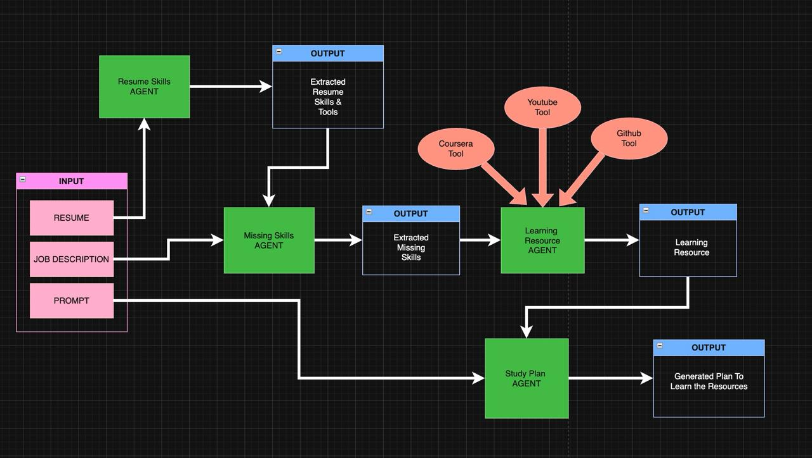

# AI-Agent-Hackathon
Mentor AI - AI Agent-based skill-building assistant 

# Mentor AI 🧠🚀

Mentor AI is an intelligent career guidance assistant that helps users bridge the gap between their current skills and a target job role. It takes in a resume and job description, identifies missing skills, recommends personalized learning resources, and generates a weekly study plan — all powered by LangChain agents, real-time APIs, and a clean React-based frontend.

---

## ✨ Key Features

- **Resume & JD Parsing:** Accepts `.docx` resumes and `.txt` job descriptions.
- **Skill Gap Analysis:** Extracts technical skills & tools from resume and compares them with job description.
- **Learning Resource Recommendations:**
  - ✅ Top GitHub projects
  - ✅ Most relevant YouTube tutorials
  - ✅ High-rated Coursera certifications
- **Weekly Study Plan:** Creates a time-optimized, hyperlink-rich study plan based on user availability.
- **Interactive Frontend:** Upload documents and view your plan instantly — just like ChatGPT.
- **Backend powered by LangChain Agents + Express.**


---

## ⚙️ Tech Stack

| Layer      | Tech Used                        |
|------------|----------------------------------|
| Frontend   | React, TypeScript, Vite          |
| Backend    | Node.js, Express, LangChain      |
| LLM        | GPT-4.0 via Azure Inference API  |
| Tools/APIs | GitHub REST API, YouTube API, Coursera |
| Parsing    | Mammoth.js (Word docs)           |

---

## 🔄 Workflow

### 1. **Upload Inputs**
- Resume (`.docx`)
- Job Description (`.txt`)
- Prompt (e.g. *"Learn missing skills in 4 weeks."*)

### 2. **Agents in Action**
| Agent | Description |
|-------|-------------|
| 🧠 `ResumeSkillAgent` | Extracts skills and tools from resume |
| 🔍 `MissingSkillsAgent` | Compares with job description |
| 📚 `LearningResourceAgent` | Uses LangChain + APIs to suggest GitHub, YouTube, and Coursera |
| 📅 `WeeklyStudyPlanAgent` | Generates structured, time-aware weekly study plan |

### 3. **Output**
- JSON response includes:
  - Missing Skills
  - Learning Resources
  - Weekly Plan (with durations & links)



---

## 🖥️ Run Locally

### 1. Clone the Repo

```bash
git clone https://github.com/ManiKran/AI-Agent-Hackathon.git
cd AI-Agent-Hackathon
```

## 2️⃣ Install backend dependencies

```bash
npm install
```

## 3️⃣ Setup environment variables(Put the Keys in the .env file)

```bash
cp .env.environment .env
```

## 4️⃣ Start the backend server

```bash
npx tsx src/server.ts
```

## 5️⃣ Setup frontend

```bash
cd src/frontend
npm install
npm run dev
```
